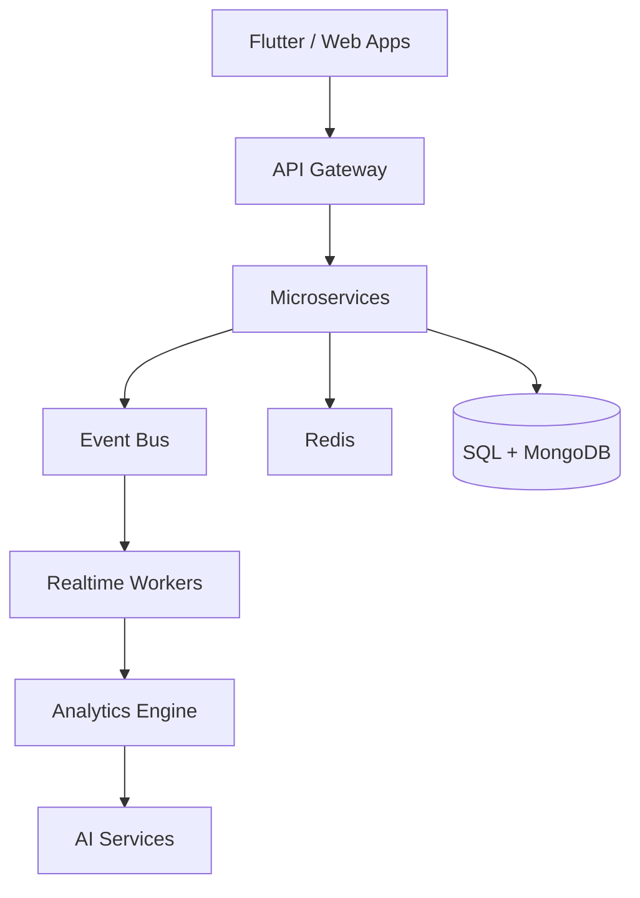

````md
<div align="center">


<br/>


<br/><br/>


<br/><br/>

<a href="mailto:piero.january15@gmail.com">

</a>

<a href="https://github.com/pierocarrion">

</a>

<br/><br/>


</div>

---

# ⚡ SYSTEM.INFO()

```yaml
name: Piero Carrion
role: Software Engineer
location: Peru 🇵🇪

specialties:
  - Distributed Systems
  - Scalable APIs
  - Clean Architecture
  - Real-time Infrastructure
  - Microservices
  - AI Integrations

currently_building:
  - FastCred
  - Wavvi
  - Realtime Geolocation Systems
  - AI-based Platforms

databases:
  - SQL Server
  - MongoDB Sharding
  - Redis
  - Firebase

cloud:
  - Azure
  - AWS
  - Docker
  - Kubernetes
````

---

# 🧠 TECH STACK

<div align="center">


</div>

---

# 📈 ENGINEERING METRICS

<div align="center">


<br/>


</div>

---

# 🚀 FEATURED PROJECTS

<div align="center">

<a href="https://github.com/pierocarrion">

</a>

<a href="https://github.com/pierocarrion">

</a>

</div>

---

# 🌌 CURRENT MINDSET

<div align="center">

```text
Design for scale.
Optimize everything.
Build resilient systems.
Automate repetitive work.
Think in architecture.
Ship fast.
```

</div>

---

# 🕸️ ARCHITECTURE PHILOSOPHY



---

# 🐍 CONTRIBUTION MATRIX

<div align="center">

<picture>
  <source media="(prefers-color-scheme: dark)" srcset="https://raw.githubusercontent.com/pierocarrion/pierocarrion/output/github-contribution-grid-snake-dark.svg">
  
</picture>

</div>

---

# 📡 CONNECT()

<div align="center">

<a href="mailto:piero.january15@gmail.com">

</a>

<a href="https://github.com/pierocarrion">

</a>

</div>

---

<div align="center">


</div>
```
